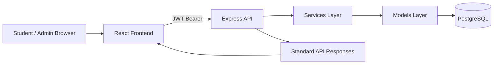
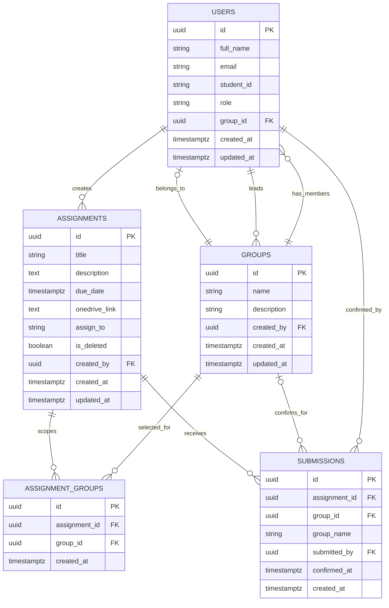

# Groupd

Groupd is a role-based full-stack Student, Group, and Assignment Management System that helps students self-organize into groups and confirm assignment submissions, while giving professors a single dashboard for progress and submission analytics.

## Overview

Academic group-work workflows are often fragmented across chat apps, LMS portals, and spreadsheets. Groupd centralizes:

- Group creation and member management.
- Assignment publishing and targeted group assignment.
- Group-level submission confirmation with audit metadata.
- Student and admin dashboards with completion analytics.

## Core Features

### Student Role

- Register and log in.
- Create a group and manage members.
- Add members by email or student ID.
- View assignments and due dates.
- Open OneDrive links per assignment.
- Confirm group submission from assignment detail (confirmation modal).
- Track progress with badges and progress bars.

### Admin Role

- Create, edit, and soft-delete assignments.
- Assign to all groups or specific selected groups.
- View all groups and group details.
- Track assignment submissions by group and by student.
- View summary metrics and chart-based analytics.

## Tech Stack

- Frontend: React, Vite, Tailwind CSS, Zustand, React Router, Recharts.
- Backend: Node.js, Express, PostgreSQL, Zod, JWT.
- Infrastructure: Docker, Docker Compose, Nginx (frontend container).
- Security: JWT auth, role guards, rate limiting, helmet, CORS.

## Architecture Overview



Backend architecture pattern:

- Routes -> Controllers -> Services -> Models.
- Middleware for auth, role checks, validation, error handling, and rate limiting.

## Project Structure

```text
.
├── backend/
│   ├── src/
│   │   ├── config/
│   │   ├── controllers/
│   │   ├── db/
│   │   ├── middleware/
│   │   ├── models/
│   │   ├── routes/
│   │   ├── services/
│   │   ├── utils/
│   │   └── validators/
├── frontend/
│   ├── src/
│   │   ├── components/
│   │   ├── layouts/
│   │   ├── pages/
│   │   ├── services/
│   │   ├── stores/
│   │   ├── styles/
│   │   └── utils/
├── docker-compose.yml
└── README.md
```

## Setup and Run

### Prerequisites

- Docker Desktop (recommended), or Docker Engine + Compose plugin.
- Node.js 20+ (for local, non-Docker development).
- npm 10+.

### Option A: Docker (Recommended)

1. Start full stack:

```bash
docker compose up --build -d
```

2. For a fresh DB re-initialization:

```bash
docker compose down -v
docker compose up --build -d
```

3. Seed demo student users:

```bash
docker compose exec backend node seed_users.js
```

4. Access services:

- Frontend: http://localhost:3000
- Backend API base: http://localhost:5000/api/v1
- Health: http://localhost:5000/api/v1/health
- PostgreSQL: localhost:5432

5. Stop services:

```bash
docker compose down
```

### Option B: Local Development

1. Start PostgreSQL separately (or keep dockerized DB only).
2. Backend setup:

```bash
cd backend
npm install
copy .env.example .env
npm run dev
```

3. Frontend setup:

```bash
cd frontend
npm install
echo VITE_API_URL=http://localhost:5000/api/v1 > .env
npm run dev
```

4. Local URLs:

- Frontend dev server: http://localhost:5173
- Backend API: http://localhost:5000/api/v1

## Demo Credentials

- Admin: admin@groupd.com / test@123
- Students (after seeding): s1@groupd.com ... s15@groupd.com / test@123

## API Response Contract

All endpoints return a standardized envelope.

Success:

```json
{
	"success": true,
	"data": {},
	"message": ""
}
```

Error:

```json
{
	"success": false,
	"error": {
		"code": "ERROR_CODE",
		"message": "Human readable message",
		"details": null
	}
}
```

## API Endpoints

Base URL: /api/v1

### Health

| Method | Endpoint | Auth | Role | Description |
|---|---|---|---|---|
| GET | /health | No | Public | Service health check |

### Auth

| Method | Endpoint | Auth | Role | Description |
|---|---|---|---|---|
| POST | /auth/register | No | Public | Register student |
| POST | /auth/login | No | Public | Login and issue tokens |
| POST | /auth/refresh | No | Public | Refresh access token |
| GET | /auth/me | Yes | Student/Admin | Current user profile |

### Groups

| Method | Endpoint | Auth | Role | Description |
|---|---|---|---|---|
| POST | /groups | Yes | Student | Create group |
| GET | /groups/my-group | Yes | Student | Fetch student's group |
| POST | /groups/members | Yes | Student | Add member by email or student_id |
| DELETE | /groups/members/:userId | Yes | Student | Remove member |
| POST | /groups/leave | Yes | Student | Leave group |
| DELETE | /groups | Yes | Student | Delete leader's group |
| GET | /groups | Yes | Admin | List all groups |
| GET | /groups/:groupId | Yes | Admin | Group details |

### Assignments

| Method | Endpoint | Auth | Role | Description |
|---|---|---|---|---|
| POST | /assignments | Yes | Admin | Create assignment |
| PUT | /assignments/:id | Yes | Admin | Update assignment |
| DELETE | /assignments/:id | Yes | Admin | Soft delete assignment |
| GET | /assignments | Yes | Student/Admin | List assignments |
| GET | /assignments/:id | Yes | Student/Admin | Assignment detail |

### Submissions

| Method | Endpoint | Auth | Role | Description |
|---|---|---|---|---|
| POST | /submissions | Yes | Student | Confirm group submission |
| GET | /submissions/my-group-submissions | Yes | Student | Group submission list |
| GET | /submissions/group-progress | Yes | Student | Group progress summary |
| GET | /submissions/assignment/:assignmentId | Yes | Admin | Assignment submissions |
| GET | /submissions/assignment/:assignmentId/groups-student-status | Yes | Admin | Group and student tracker |

### Dashboard

| Method | Endpoint | Auth | Role | Description |
|---|---|---|---|---|
| GET | /dashboard/student | Yes | Student | Student dashboard data |
| GET | /dashboard/admin/summary | Yes | Admin | Admin summary metrics |
| GET | /dashboard/admin/assignments-analytics | Yes | Admin | Assignment completion analytics |
| GET | /dashboard/admin/groups-analytics | Yes | Admin | Group performance analytics |

## Key Request Payloads

Create group:

```json
{
	"name": "Team Alpha",
	"description": "Optional group description"
}
```

Add member:

```json
{
	"email": "student@college.edu"
}
```

or

```json
{
	"student_id": "22CS101"
}
```

Create assignment:

```json
{
	"title": "Assignment 1",
	"description": "Submission brief",
	"due_date": "2026-04-30T12:00:00.000Z",
	"onedrive_link": "https://onedrive.live.com/...",
	"assign_to": "specific",
	"group_ids": ["uuid-1", "uuid-2"]
}
```

Confirm submission:

```json
{
	"assignment_id": "assignment-uuid"
}
```

## Database Schema and Relationships

Core tables:

- users
- groups
- assignments
- assignment_groups
- submissions

Relationship summary:

- A student can belong to one group at a time via users.group_id.
- A group has a leader via groups.created_by.
- Assignments can target all groups or specific groups.
- assignment_groups models many-to-many links for specific assignments.
- submissions stores one confirmation per group-assignment pair.
- group_name is preserved in submissions for audit when a group is deleted.

### ER Diagram (Mermaid)



## Architecture Notes (Frontend + Backend + DB Flow)

1. Frontend pages trigger store actions.
2. Stores call service wrappers around Axios.
3. Axios attaches JWT and handles refresh flow.
4. Express routes validate payloads and enforce auth/role access.
5. Services execute business rules.
6. Models execute parameterized SQL against PostgreSQL.
7. Responses return in a standardized envelope.

## Key Design Decisions

- Group-level submission confirmation: aligns with team-based assignment workflows.
- One-group-per-student: enforced in business logic and data model.
- Soft-delete assignments: preserves auditability while hiding old items.
- Snapshot group_name in submissions: preserves historical tracking after group deletion.
- Layered backend design: keeps controllers thin and business logic centralized.
- Centralized client state with Zustand: simple and modular for role-specific dashboards.

## Deployment Decisions

- Docker Compose orchestration for reproducible full-stack startup.
- PostgreSQL init scripts mounted into /docker-entrypoint-initdb.d in lexical order.
- Frontend served by Nginx container for production-like static hosting.
- Backend configured by environment variables only (no hardcoded secrets).

## Notes on Assignment Visibility

- Students can browse assignments posted to all groups even before joining a group.
- Group-targeted assignments and submission confirmation are available once a student is in a group.

## Current Status

- Backend and frontend run in Docker.
- Auth, groups, assignments, submissions, and dashboard modules are implemented.
- Admin and student roles are enforced via JWT and route guards.
