# Groupd

Groupd is a full-stack assignment management platform for student teams and faculty/admin workflows.

It supports:
- student authentication, group creation, team membership, and assignment progress
- admin course management, enrollments, assignment publishing, and submission analytics
- group and individual submission modes with confirmation-token based finalization

## Project Links

- [GitHub Repository](https://github.com/VarunPandrangi/groupd.git)
- [Working Demo Video](https://drive.google.com/file/d/1ko1t882LokECXr65FtbrQ_PRZ9zroSwo/view?usp=drive_link)
- [Vercel Deployed Link](https://groupd-navy.vercel.app)
- Deployment note: the live frontend depends on a Render-hosted backend and a MongoDB Atlas free-tier database, so the first load can take a while.

## What Changed (Current Codebase)

This README is updated to the current implementation in this repository.

Key changes reflected in code:
- active runtime data layer is MongoDB + Mongoose, with no SQL path in the current backend
- new `Course` domain with enrollment rules and ownership checks
- assignments now require `course_id` in the API payload and support `submission_type` (`group` or `individual`)
- stricter group assignment validation: targeted groups must have all members enrolled in the assignment course
- submission model supports both:
  - group submission uniqueness (`assignment + group`)
  - individual submission uniqueness (`assignment + submittedBy` when `group=null`)
- admin dashboard expanded with assignment/group/individual analytics (Recharts)
- frontend UI uses an architectural, high-contrast visual system and role-specific workspaces

## UI/UX Design Overview (Choices + Why)

### 1) Role-first navigation
- Student and admin shells are split at route/layout level (`StudentLayout`, `AdminLayout`) so each role sees only relevant actions.
- Why: reduces decision overhead and prevents accidental cross-role actions.

### 2) High-signal status language
- Assignment and submission states are always visible via chips/badges (`overdue`, `active`, `upcoming`, `submitted`).
- Why: users can prioritize work quickly without opening detail pages.

### 3) Strong visual hierarchy for operational screens
- Dashboards and registries use distinct card tiers, rails, and contrast blocks for counts, deadlines, and critical actions.
- Why: operational tasks (enroll, publish, submit, track) benefit from scannable structure over decorative UI.

### 4) Guided empty states and blocked-state UX
- No-group and no-data states provide explicit next actions (create group, enroll students, create assignment).
- Why: users do not get stranded when prerequisites are missing.

### 5) Two-step submission confirmation
- Student submission uses `prepare -> confirm` flow with short-lived confirmation token.
- Why: reduces accidental final submissions and aligns UI confirmation with backend safeguards.

### 6) Responsive architecture
- Desktop-first dashboards with mobile breakpoints across auth, course, group, and tracker pages.
- Why: keeps complex tables/analytics usable on small screens while preserving admin density on desktop.

### 7) Motion with restraint
- Framer Motion is used for page/section reveal, grouped content staggering, and micro-interactions.
- Why: improves perceived responsiveness while keeping movement purposeful and lightweight.

## UI Flow Screenshots

### Authentication

#### Login
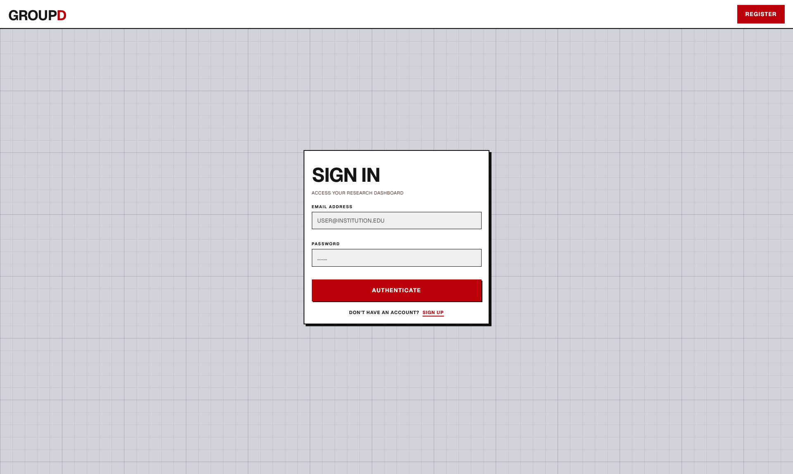

#### Signup
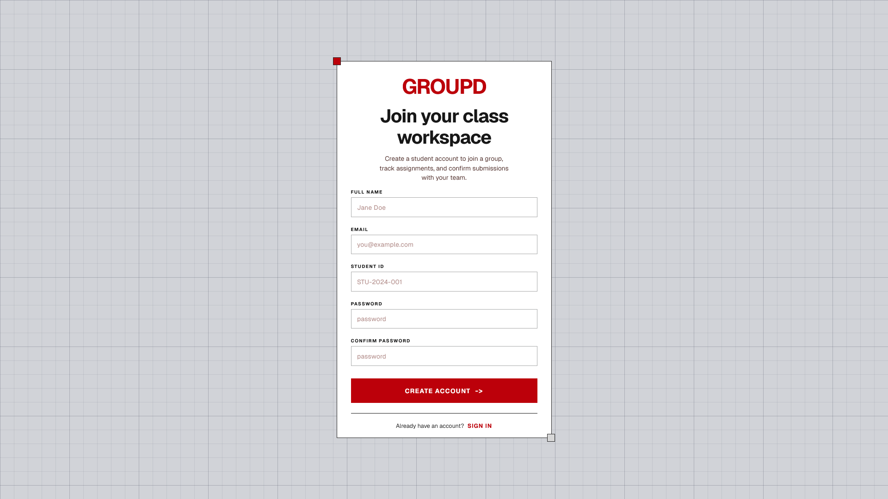

### Student Flow

#### Dashboard


#### Assignment List
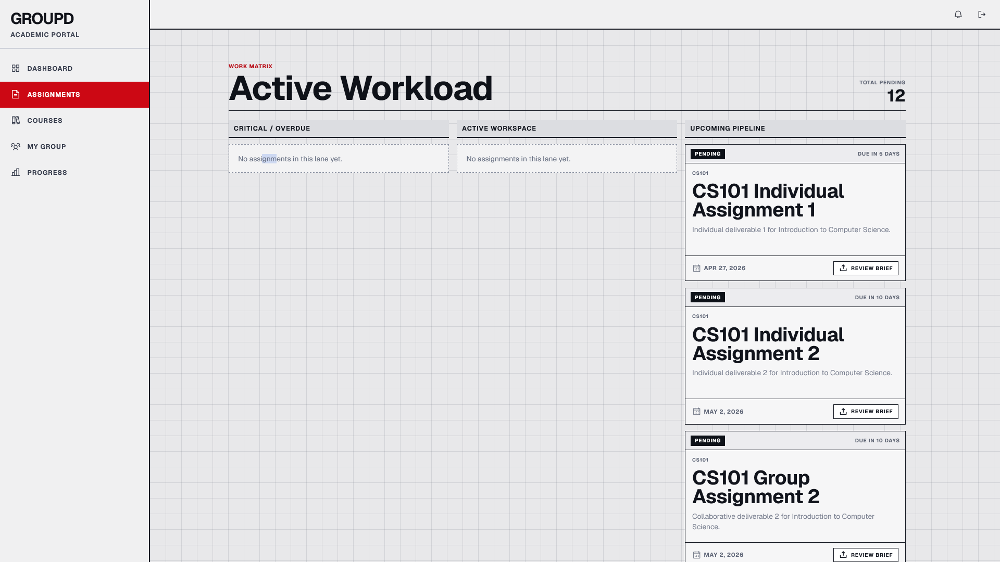

#### Assignment Detail
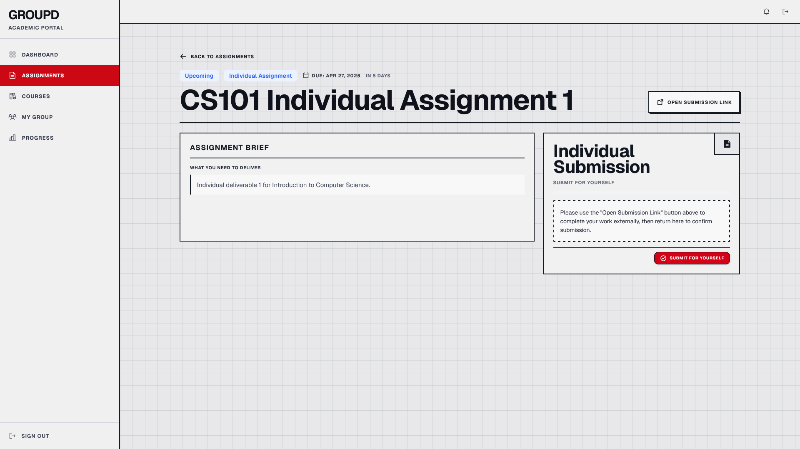

#### Courses List
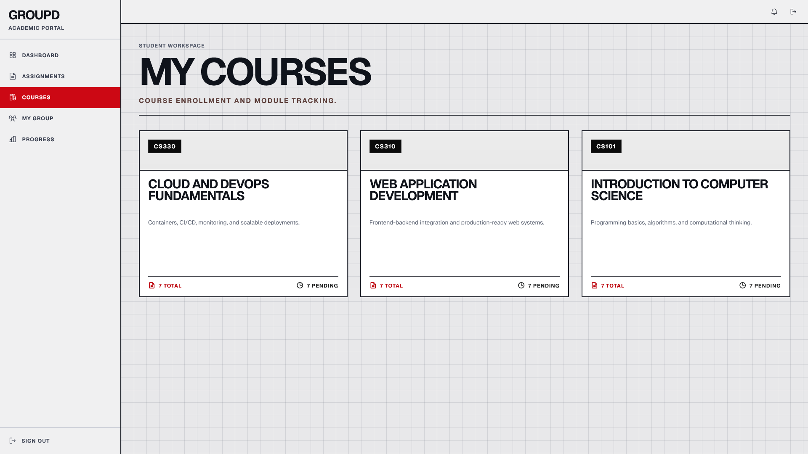

#### Course Detail
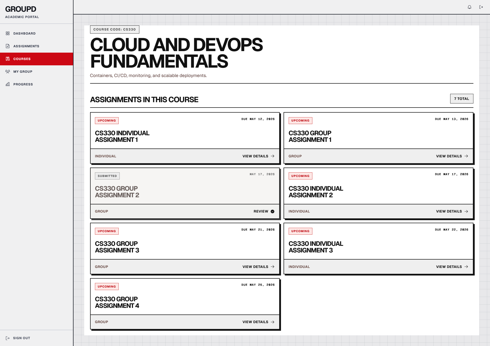

#### My Group


#### Progress Tracker


### Admin Flow

#### Assignment Manager
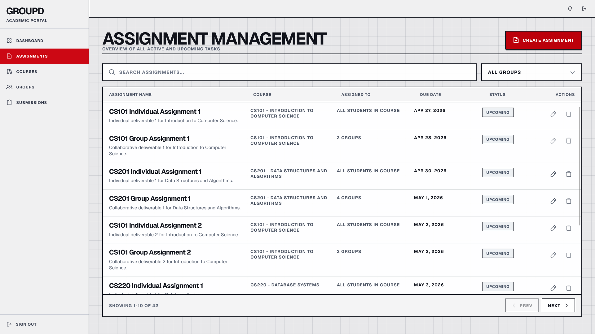

#### Courses List
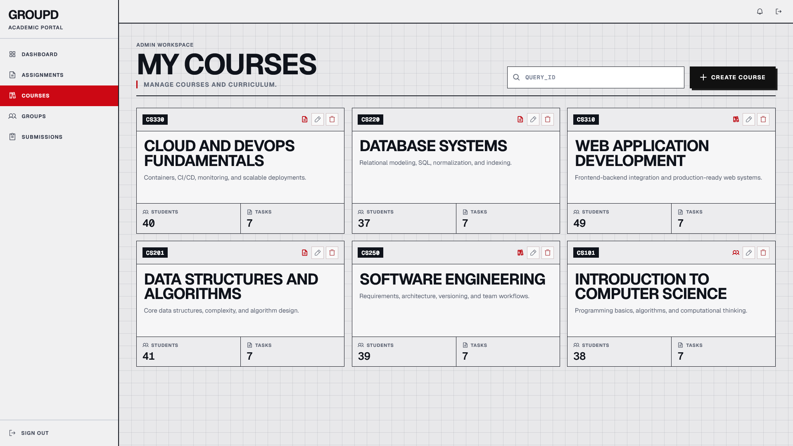

#### Course Detail
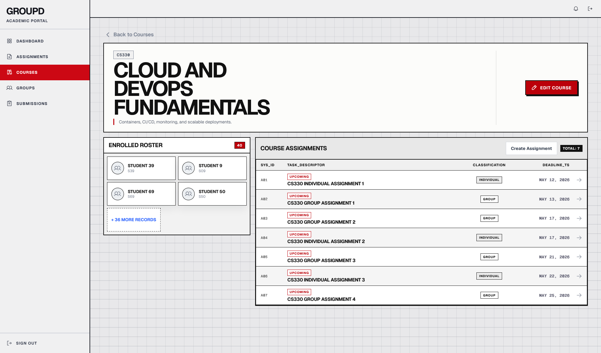

#### Enrollment Manager
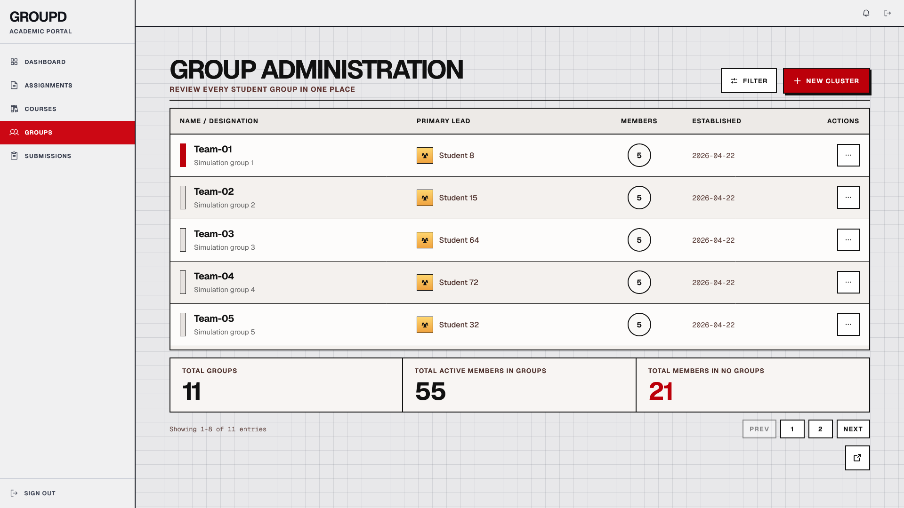

#### Submission Tracker
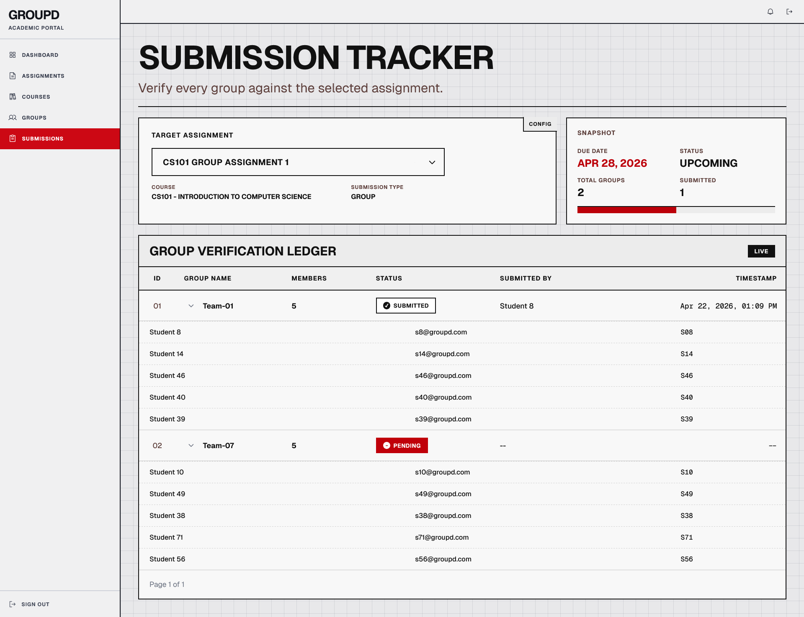

> GIFs are optional in this repo and are not currently committed. The screenshot set above covers login, signup, student dashboards, course and group flows, assignment submission, and admin management pages.

## Component Architecture (Frontend)

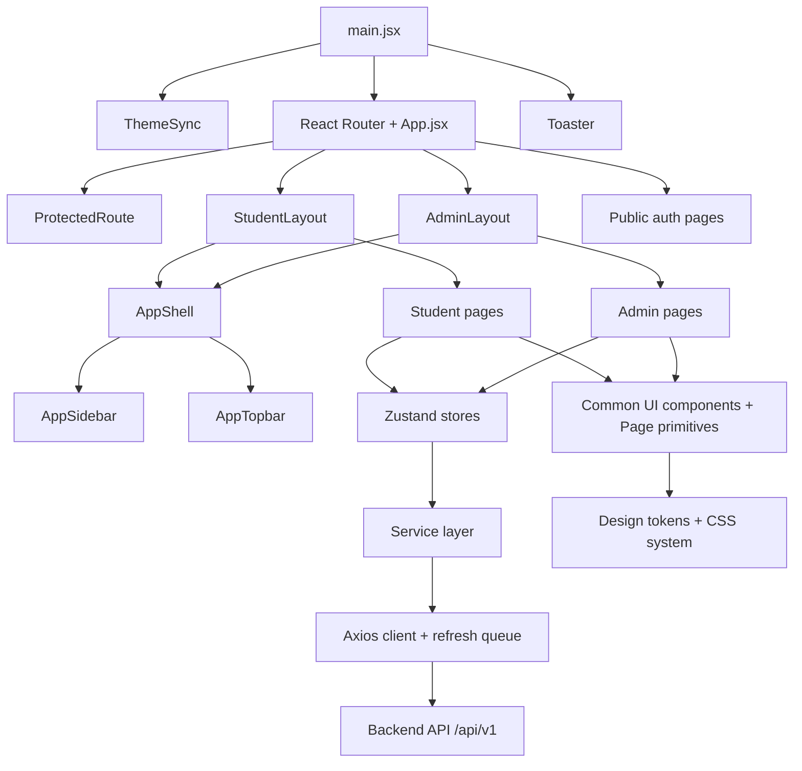
```mermaid
flowchart TD
  M[main.jsx] --> T[ThemeSync]
  M --> R[React Router + App.jsx]
  M --> N[Toaster]

  R --> P[ProtectedRoute]
  R --> S1[StudentLayout]
  R --> S2[AdminLayout]
  R --> P0[Public auth pages]

  S1 --> A1[AppShell]
  S2 --> A1
  A1 --> A2[AppSidebar]
  A1 --> A3[AppTopbar]

  S1 --> D1[Student pages]
  S2 --> D2[Admin pages]

  D1 --> E1[Zustand stores]
  D2 --> E1

  E1 --> F1[Service layer]
  F1 --> G1[Axios client + refresh queue]
  G1 --> H1[Backend API /api/v1]

  D1 --> I1[Common UI components + Page primitives]
  D2 --> I1
  I1 --> J1[Design tokens + CSS system]
```

Component architecture summary:
- `main.jsx` mounts `ThemeSync`, `App`, and the toast container inside `BrowserRouter`.
- `App.jsx` defines the full route tree and role-based page entry points.
- `ProtectedRoute` guards authenticated routes and redirects users by role.
- `StudentLayout` and `AdminLayout` provide role-specific shells and navigation on top of `AppShell`.
- `AppShell` composes `AppSidebar` and `AppTopbar` around the routed page content.
- Route pages in `frontend/src/pages/*` act as feature containers and orchestrate store/service calls.
- Shared UI in `frontend/src/components/*` keeps forms, modals, cards, tables, empty states, and motion primitives reusable.
- Zustand stores in `frontend/src/stores/*` own client state and async actions.
- API services in `frontend/src/services/*` isolate backend calls from page logic.
- `frontend/src/styles/index.css` defines the token system, layout primitives, and visual language used across pages.

Directory-level architecture:
- `frontend/src/pages/*`: route-level containers
- `frontend/src/layouts/*`: role shells and shared app shell composition
- `frontend/src/components/*`: reusable UI blocks, motion primitives, and specialized page components
- `frontend/src/stores/*`: Zustand state + async actions
- `frontend/src/services/*`: API-bound domain service functions
- `frontend/src/styles/index.css`: design tokens + page/component class systems

## Backend Architecture

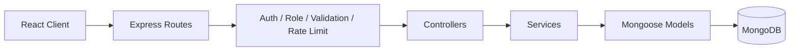
```mermaid
flowchart LR
  UI[React Client] --> RT[Express Routes]
  RT --> MW[Auth / Role / Validation / Rate Limit]
  MW --> CT[Controllers]
  CT --> SV[Services]
  SV --> MD[Mongoose Models]
  MD --> DB[(MongoDB)]
```

Layering in code:
- Routes: `backend/src/routes/*`
- Controllers: `backend/src/controllers/*`
- Services: `backend/src/services/*`
- Models: `backend/src/models/*`
- Middleware: `backend/src/middleware/*`

## Tech Stack

### Frontend
- React 19 + Vite 8
- Zustand
- React Router
- Framer Motion
- Recharts
- Tailwind CSS 4 + custom tokenized CSS

### Backend
- Node.js + Express
- Mongoose (MongoDB ODM)
- Zod validation
- JWT auth
- Winston logging
- Helmet, CORS, Morgan, express-rate-limit

### Infra
- Docker Compose
- MongoDB 7
- Nginx container for frontend static serving

## Database Model and Changes

## Current Database
- Type: MongoDB
- ODM: Mongoose
- Connection: `mongoose.connect(MONGODB_URI, { dbName: 'groupd' })`

## Core Collections

### `users`
- `fullName`, `email (unique)`, `password`, `role`, `studentId (unique+sparse)`, `refreshToken`, `isDeleted`

### `groups`
- `name (unique)`, `description`, `createdBy`, `members[]`, `isDeleted`

### `courses`
- `name`, `code (unique)`, `description`, `createdBy`, `enrolledStudents[]`, `isDeleted`

### `assignments`
- `title`, `description`, `dueDate`, `onedriveLink`, `assignTo (all|group)`, `submissionType (group|individual)`, `course`, `createdBy`, `groupTargets[]`, `isDeleted`

### `submissions`
- `assignment`, `submittedBy`, `group (nullable)`, `groupNameSnapshot`, `submittedAt`, `confirmedAt`, `status`

## Important Index/Constraint Behavior
- `users.email` unique
- `users.studentId` unique+sparse
- `courses.code` unique
- `groups.name` unique
- `submissions` unique partial indexes:
  - `{ assignment, group }` when `group` is objectId
  - `{ assignment, submittedBy }` when `group` is null

## Database Changes vs Older SQL-style Design
- SQL table migration scripts are no longer used in runtime.
- Group membership is derived from `groups.members`; there is no persisted `users.group_id` column.
- Assignment-to-group mapping uses `assignTo + groupTargets[]` in assignment documents.
- Submission history keeps `groupNameSnapshot` for deleted-group audit continuity.
- Soft delete is handled with `isDeleted` flags across domain collections.

## API Surface (High-level)

Base path: `/api/v1`

### Health
- `GET /health`

### Auth
- `POST /auth/register`
- `POST /auth/login`
- `POST /auth/refresh`
- `POST /auth/logout`
- `GET /auth/me`

### Courses
- `POST /courses` (admin)
- `GET /courses` (admin/student)
- `GET /courses/:id`
- `PUT /courses/:id` (admin)
- `DELETE /courses/:id` (admin, soft delete)
- `POST /courses/:id/enrollments` (admin)
- `DELETE /courses/:id/enrollments/:studentId` (admin)
- `GET /courses/:id/students` (admin)

### Groups
- `POST /groups` (student)
- `GET /groups/my-group` (student)
- `POST /groups/members` (student leader)
- `DELETE /groups/members/:userId` (student leader)
- `POST /groups/leave` (student)
- `DELETE /groups` (student leader)
- `GET /groups` (admin)
- `GET /groups/:groupId` (admin)

### Assignments
- `POST /assignments` (admin)
- `PUT /assignments/:id` (admin)
- `DELETE /assignments/:id` (admin, soft delete)
- `GET /assignments` (student/admin)
- `GET /assignments/:id` (student/admin)

### Submissions
- `POST /submissions/prepare` (student)
- `POST /submissions` (student)
- `GET /submissions/my-group-submissions` (student)
- `GET /submissions/group-progress` (student)
- `GET /submissions/assignment/:assignmentId` (admin)
- `GET /submissions/assignment/:assignmentId/groups-student-status` (admin)

### Dashboard
- `GET /dashboard/student`
- `GET /dashboard/admin/summary`
- `GET /dashboard/admin/assignments-analytics`
- `GET /dashboard/admin/groups-analytics`

## Local Setup

## Prerequisites
- Node.js 20+
- npm 10+
- Docker Desktop (for containerized setup)

## Option A: Docker (Recommended)

From repo root:

```bash
docker compose up --build -d
```

Services:
- Frontend: `http://localhost:3000`
- Backend: `http://localhost:5000/api/v1`
- MongoDB: `mongodb://localhost:27017/groupd`

Seed options:

```bash
# minimal admin + legacy course
# admin: admin@joineazy.com / Admin@123
docker compose exec backend node src/db/seed.js

# add 75 student accounts
# students: s1@groupd.com ... s75@groupd.com / test@123
docker compose exec backend node seed_users.js

# full simulation dataset (resets and generates courses/groups/assignments/submissions)
# admin: admin@groupd.com / test@123
docker compose exec backend npm run seed:simulation
```

Stop stack:

```bash
docker compose down
```

Reset DB volume:

```bash
docker compose down -v
```

## Option B: Run Backend + Frontend on Host

### 1) Start MongoDB
Use local MongoDB or only run Mongo container:

```bash
docker compose up -d mongo
```

### 2) Backend

```bash
cd backend
npm install
```

Create env file:
- copy `backend/.env.example` to `backend/.env`

Required backend env:
- `MONGODB_URI`
- `JWT_SECRET`
- `JWT_REFRESH_SECRET`
- `PORT`
- `CORS_ORIGIN`

Then run:

```bash
npm run dev
```

### 3) Frontend

```bash
cd frontend
npm install
```

Create/update `frontend/.env`:

```env
VITE_API_URL=http://localhost:5000/api/v1
```

Then run:

```bash
npm run dev
```

Local URLs:
- Frontend (Vite): `http://localhost:5173`
- Backend API: `http://localhost:5000/api/v1`

## Environment Variables

### Backend (`backend/.env`)

| Variable | Required | Example |
| --- | --- | --- |
| `MONGODB_URI` | Yes | `mongodb://localhost:27017/groupd` |
| `JWT_SECRET` | Yes | `change-this-to-a-random-secret-string` |
| `JWT_REFRESH_SECRET` | Yes | `change-this-to-another-random-secret` |
| `PORT` | Yes | `5000` |
| `CORS_ORIGIN` | Yes | `http://localhost:5173` |
| `NODE_ENV` | No | `development` |
| `RATE_LIMIT_WINDOW_MS` | No | `900000` |
| `GENERAL_RATE_LIMIT_MAX` | No | `100000` |
| `AUTH_RATE_LIMIT_MAX` | No | `5000` |

### Frontend (`frontend/.env`)

| Variable | Required | Example |
| --- | --- | --- |
| `VITE_API_URL` | Yes | `http://localhost:5000/api/v1` |

## CORS Note
Current backend CORS implementation checks `origin.startsWith(CORS_ORIGIN)`. Use one concrete origin value (for example `http://localhost:5173` or `http://localhost:3000`) and restart backend after changing it.

## Scripts Reference

Repo-root helper scripts:
- `node seed_test_data.js` -> API-based student registration helper (15 students)
- `node setup_demo.js` -> legacy demo helper (not updated for required `course_id` in assignment creation)

Backend:
- `npm run dev` -> nodemon server
- `npm start` -> production server
- `npm run seed` -> `src/db/seed.js`
- `npm run seed:simulation` -> full simulation + report generation

Frontend:
- `npm run dev` -> Vite dev server
- `npm run build` -> production build
- `npm run preview` -> preview build

## Project Structure

```text
.
|-- backend/
|   |-- src/
|   |   |-- app.js
|   |   |-- server.js
|   |   |-- config/
|   |   |-- controllers/
|   |   |-- middleware/
|   |   |-- models/
|   |   |-- routes/
|   |   |-- services/
|   |   |-- validators/
|   |   |-- utils/
|   |   `-- db/
|   |-- seed_users.js
|   `-- seed_full_simulation.js
|-- frontend/
|   |-- public/
|   |-- src/
|   |   |-- main.jsx
|   |   |-- App.jsx
|   |   |-- assets/
|   |   |-- stitch/
|   |   |-- layouts/
|   |   |-- pages/
|   |   |   |-- admin/
|   |   |   |-- auth/
|   |   |   `-- student/
|   |   |-- components/
|   |   |   |-- admin/
|   |   |   |-- common/
|   |   |   `-- student/
|   |   |-- stores/
|   |   |-- services/
|   |   |-- styles/
|   |   `-- utils/
|   |-- Dockerfile
|   `-- nginx.conf
|-- docs/
|   `-- screenshots/
|-- docker-compose.yml
`-- README.md
```

## Troubleshooting

### 1) `401` loops or forced logout
- Check access/refresh token flow in browser storage.
- Verify `JWT_SECRET` and `JWT_REFRESH_SECRET` are unchanged between server restarts.

### 2) CORS blocked in browser
- Ensure backend `CORS_ORIGIN` matches the active frontend URL.
- Restart backend after env updates.

### 3) Admin login does not work on fresh DB
- Run one of:
  - `docker compose exec backend node src/db/seed.js`
  - `docker compose exec backend npm run seed:simulation`

### 4) Frontend route 404 on refresh (deployed static host)
- Use SPA fallback rewrite to `index.html`.
- Nginx config in this repo already does this inside Docker image.

---

If you want, I can also add a short API contract appendix (request/response samples) directly in this README.
